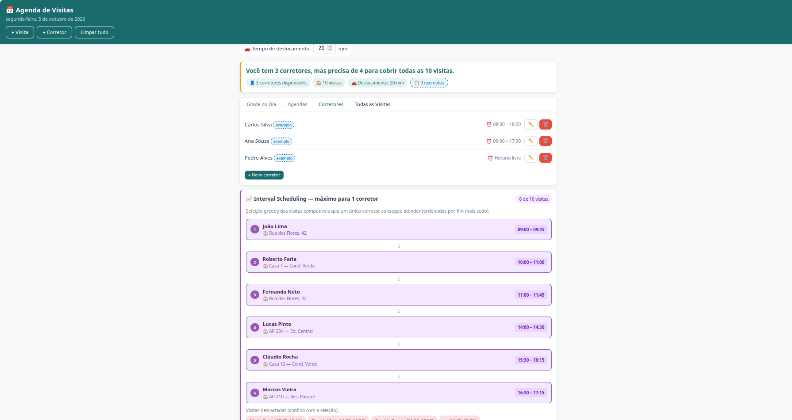
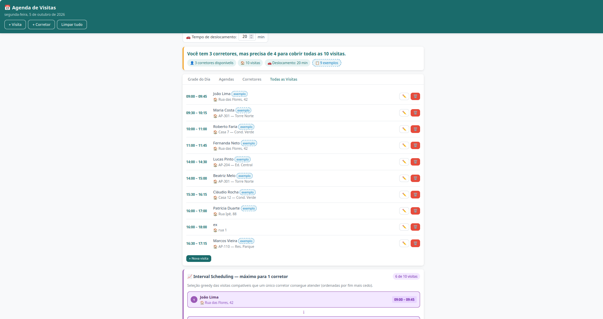
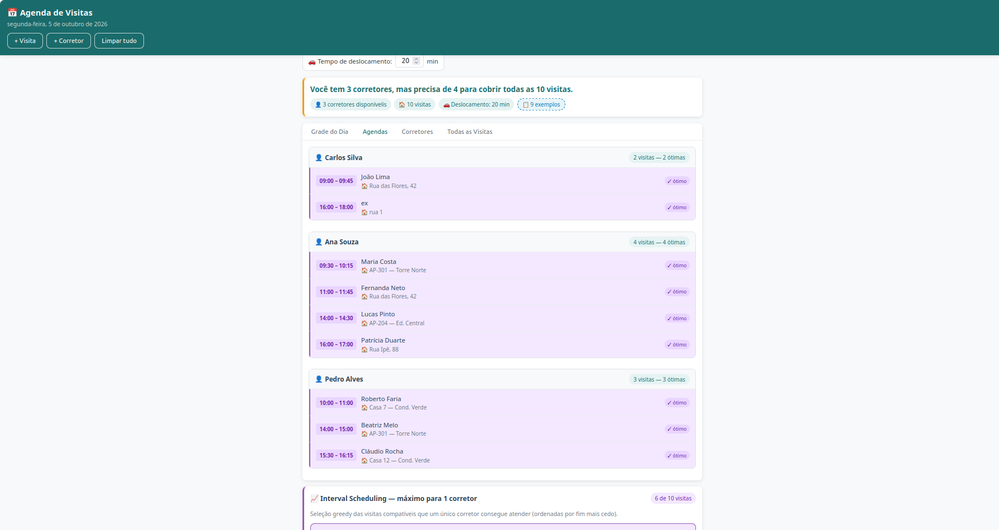

# G47_Greedy_PA-26.2 - Agenda de Visitas Imobiliárias

Trabalho prático sobre Algoritmos Gulosos (Greedy) da matéria de **Projeto de Algoritmos (2026/2)**.

##  Integrantes

| Matrícula | Nome | Usuário GitHub |
| :--- | :--- | :--- |
| 232027476 | João Guilherme | [@jonas3688](https://github.com/jonas3688) |
| 232013917 | Arthur Gomes Oliveira | [@arthurgomes1290](https://github.com/arthurgomes1290) |

---

##  Sobre o Projeto

O projeto consiste em uma aplicação web interativa desenvolvida com **FastAPI** e **HTML/CSS/JS puro** para visualização e execução dos algoritmos de **Interval Partitioning** e **Interval Scheduling** aplicados ao problema real de agendamento de visitas imobiliárias.

O cenário prático modelado é o de uma **imobiliária** que precisa distribuir visitas a imóveis entre corretores ao longo do dia. A aplicação permite:

1. Cadastrar visitas com cliente, imóvel e horário de início e fim.
2. Cadastrar corretores com turno de trabalho opcional.
3. Visualizar a distribuição automática das visitas na **Grade do Dia**.
4. Acompanhar o resultado do Interval Scheduling na **aba Agendas** e no **card de seleção ótima**.
5. Detectar conflitos de imóvel (mesmo imóvel com horários sobrepostos) com aviso visual.

---

##  Vídeo de Demonstração +  Screenshots

O vídeo demonstrando o funcionamento da aplicação, casos de uso e a explicação prática dos algoritmos pode ser assistido no YouTube clicando na imagem abaixo ou pelo link direto:

[](https://youtu.be/BwBTPgX__o4)

* 🎥 **Link direto para o YouTube:** [https://youtu.be/BwBTPgX__o4](https://youtu.be/BwBTPgX__o4)

---

##  Algoritmos Utilizados

### 1. Interval Partitioning

Responde à pergunta: **qual o número mínimo de corretores necessários para cobrir todas as visitas?**

#### Passos do Algoritmo:
1. **Ordenação:** Ordena todas as visitas por horário de início.
2. **Slots:** Para cada visita, verifica se existe algum corretor já livre (respeitando o tempo de deslocamento configurável).
3. **Reutilização:** Se houver corretor disponível, reutiliza o que ficou livre mais recentemente. Caso contrário, abre um novo slot.
4. **Resultado:** O número total de slots abertos é o mínimo de corretores necessários.


#### Onde aparece na aplicação:
* **Resumo do dia** — exibe quantos corretores são necessários e se os disponíveis são suficientes.
* **Grade do Dia** — mostra cada visita alocada em sua faixa de tempo por corretor.

---

### 2. Interval Scheduling

Responde à pergunta: **qual o máximo de visitas que um único corretor consegue atender?**

#### Passos do Algoritmo:
1. **Ordenação:** Ordena as visitas por horário de **término** (chave greedy).
2. **Seleção:** Seleciona a próxima visita que começa após o término da última selecionada.
3. **Resultado:** Lista de visitas compatíveis que maximiza o número de atendimentos.


#### Onde aparece na aplicação:
* **Card roxo** — lista as visitas selecionadas e as descartadas por conflito para um único corretor.
* **Aba Agendas** — para cada corretor, marca suas visitas como ótimas ou em conflito com base no Interval Scheduling individual.

---

##  Como Executar o Projeto

### Pré-requisitos
* Python 3.10 ou superior
* Gerenciador de pacotes `pip`

### Instalação e Execução

1. **Clone o repositório:**
   ```bash
   git clone https://github.com/projeto-de-algoritmos-2026/G47_Greedy_PA-26.2.git
   cd G47_Greedy_PA-26.2
   ```

2. **Instale as dependências:**
   ```bash
   pip install -r backend/requirements.txt
   ```

3. **Inicie a aplicação:**
   ```bash
   cd backend
   python3 -m uvicorn main:app --reload --port 8000
   ```

4. **Acesse no navegador:**
   Abra [http://localhost:8000](http://localhost:8000) no seu navegador.

5. **Documentação interativa da API:**
   Acesse [http://localhost:8000/docs](http://localhost:8000/docs) para testar os endpoints diretamente.


## Screenshots







---

## 🛠️ Tecnologias Utilizadas

* **Backend:** Python 3 + FastAPI + Uvicorn
* **Frontend:** HTML5, CSS3, JavaScript puro (sem frameworks)
* **Persistência:** LocalStorage do navegador
